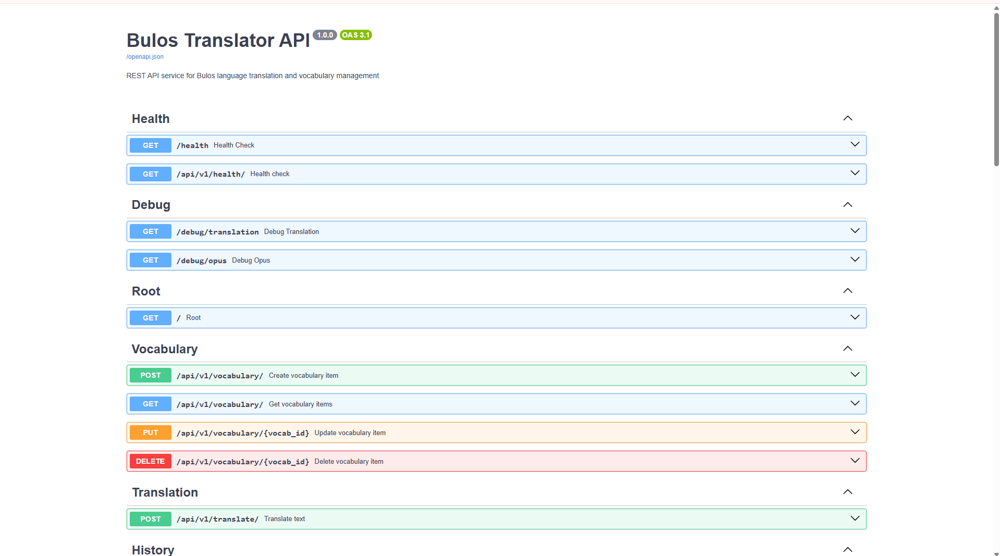
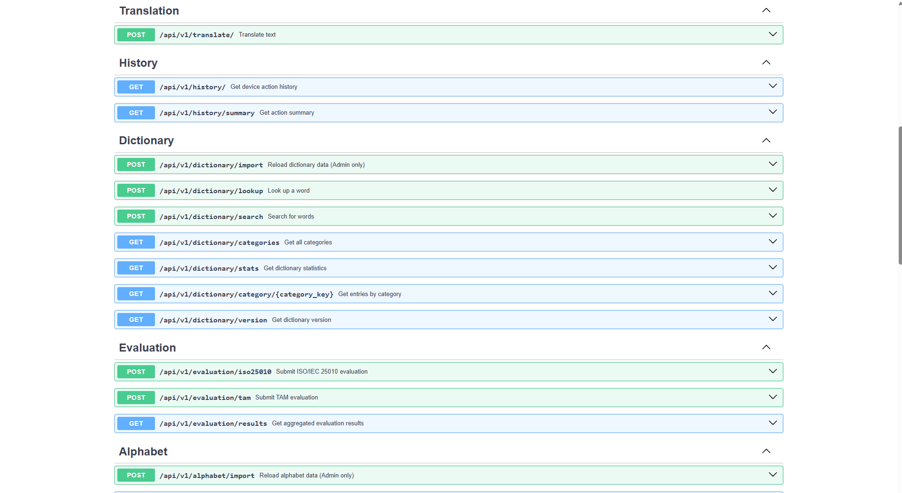
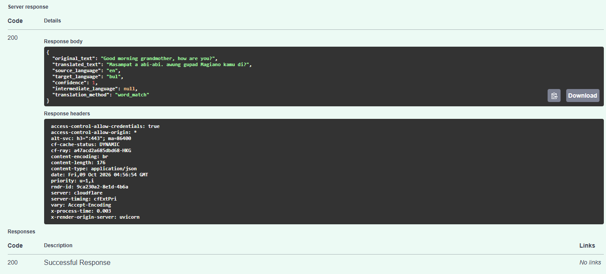

# Desiree Nicole Bernido

Data Science student seeking full-time, entry-level opportunities in technology and data.

I am pursuing a **BS in Data Science** at **Bulacan State University — Sarmiento Campus**. My academic experience includes building a translation application's backend with **Python and FastAPI**.

## Skills

- **Backend development:** Python, FastAPI, API development and UI integration
- **Translation systems:** Phrase and dictionary matching, fuzzy matching, LSTM model training
- **Tools:** Microsoft Excel

## Featured project

### Bulos Translator

**Role: Backend Developer · Academic team capstone**

An Android application focused on preserving the Bulos language used by the Dumagat community in Sitio Karahume, San Isidro, City of San Jose del Monte, Bulacan.

**My contributions**
- Created the backend API using Python and FastAPI.
- Handled the database setup and integration.
- Deployed the backend and supported its integration with the application's UI.
- Prepared the translation data files and handled LSTM translation model training.
- Implemented hybrid translation logic combining phrase matching, dictionary-based translation, and fuzzy matching.

**Explore the project**
- [Backend repository](https://github.com/your-desire/Bulos-Translator-backend)
- [FastAPI application](https://github.com/your-desire/Bulos-Translator-backend/blob/main/app/main.py)
- [Translation logic](https://github.com/your-desire/Bulos-Translator-backend/blob/main/services/translation.py)
- [LSTM training script](https://github.com/your-desire/Bulos-Translator-backend/blob/main/scripts/train_lstm.py)
- [Fuzzy matching implementation](https://github.com/your-desire/Bulos-Translator-backend/blob/main/utils/fuzzy_match.py)

This was a team project; the contributions above describe my backend responsibilities. The project's full title is *Mobile Translator for the Dumagat Language with Speech Recognition Features*.

### API documentation screenshots

**API overview:** FastAPI documentation showing vocabulary management and the translation endpoint.

View dictionary, history, and evaluation endpoints

These screenshots show the documented API structure; they do not show a completed translation test.

### Sample translation response

A sample English-to-Bulos request returned **HTTP 200** with translation text and the `word_match` method.

## Career interests

Backend development, technical support, and data-related roles.

## Contact

- **Email:** desireenicolebernido9@gmail.com
- **Location:** City of San Jose del Monte, Bulacan, Philippines
- **GitHub:** [your-desire](https://github.com/your-desire)
